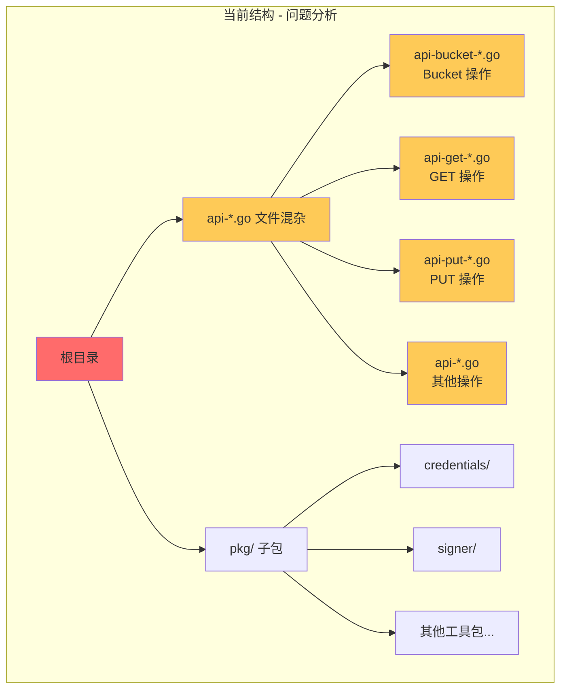
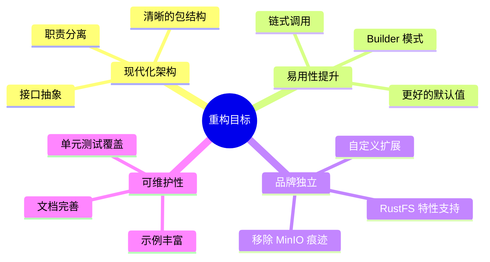
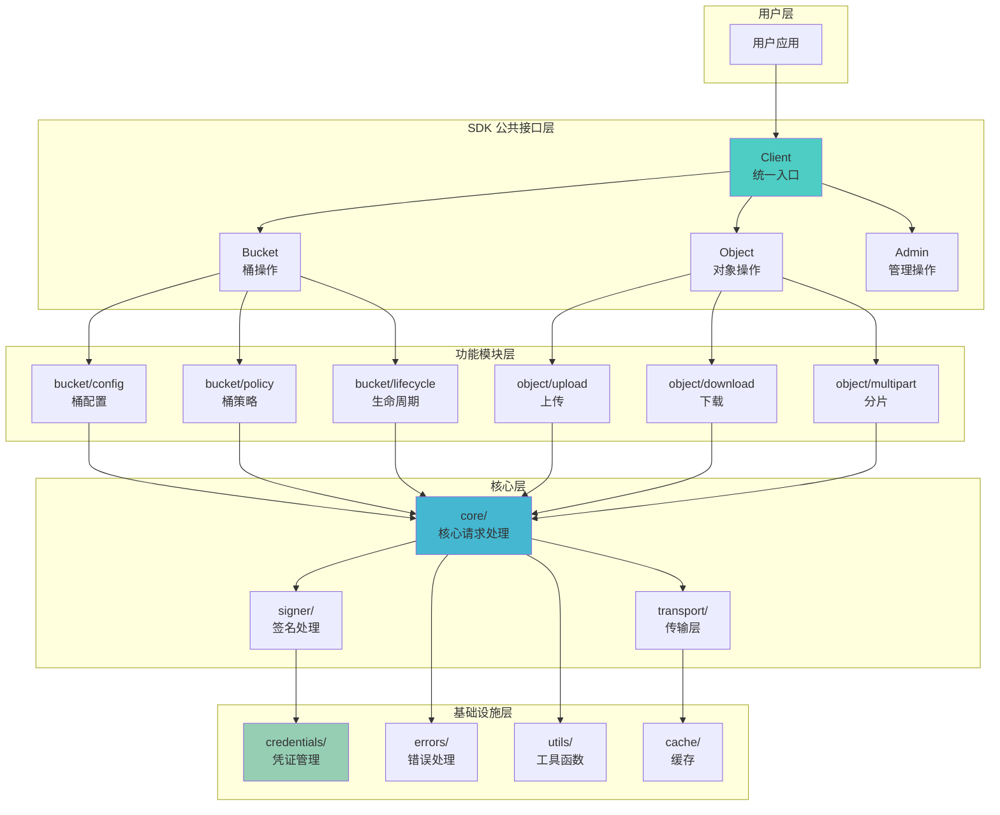
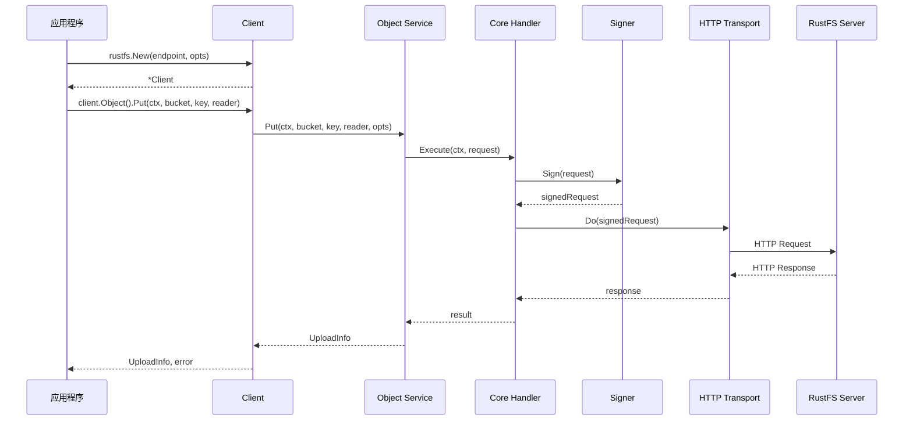
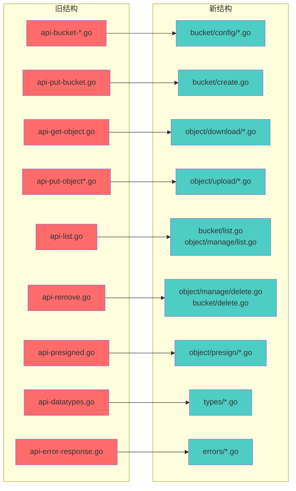
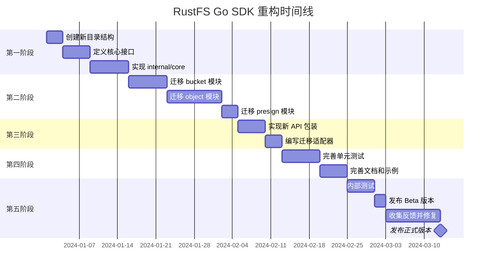
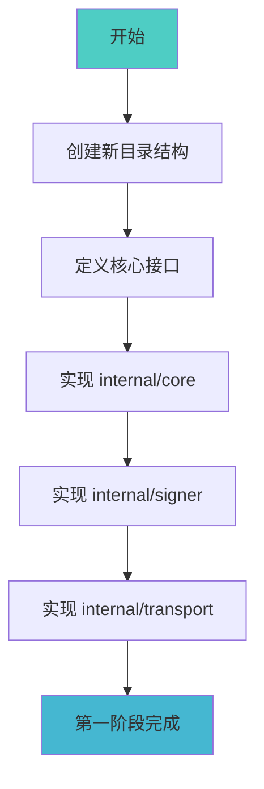
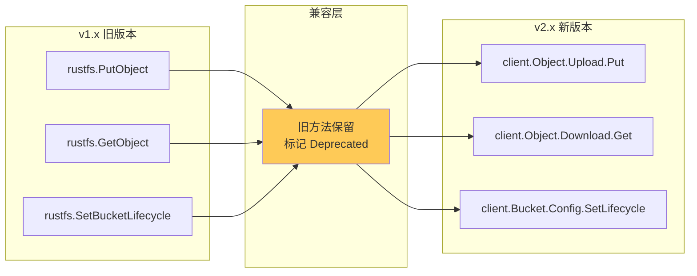

# RustFS Go SDK 重构方案

## 📋 目录

1. [项目概述](#项目概述)
2. [现状分析](#现状分析)
3. [重构目标](#重构目标)
4. [新架构设计](#新架构设计)
5. [目录结构重组](#目录结构重组)
6. [API 重新设计](#api-重新设计)
7. [实施步骤](#实施步骤)
8. [迁移指南](#迁移指南)

---

## 项目概述

RustFS Go SDK 是一个专为 RustFS 对象存储服务设计的 Go 语言客户端库，完全兼容 S3 协议。本重构方案旨在：

- 🎯 建立独立的品牌身份，摆脱 MinIO 依赖
- 🏗️ 采用现代化的 Go 项目结构
- 🔧 提供更清晰、更易用的 API
- 📦 优化包组织，提高可维护性

---

## 现状分析

### 当前文件结构问题



### 当前问题清单

| 问题类型 | 描述 | 影响 |
|---------|------|------|
| 📁 文件组织混乱 | 30+ 个 api-*.go 文件在根目录 | 难以定位功能代码 |
| 🏷️ 命名不统一 | api-bucket-*, api-get-*, api-put-* 混用 | 增加学习成本 |
| 📝 遗留注释 | 仍有 MinIO 相关的注释和命名 | 品牌混淆 |
| 🔗 耦合度高 | 数据类型与业务逻辑混合 | 难以测试和维护 |
| 📚 文档分散 | 缺乏统一的 API 文档结构 | 用户使用困难 |

### 当前 API 文件分析

```
根目录文件 (30+ 个):
├── api.go                      # 核心 API 定义
├── api-datatypes.go            # 数据类型
├── api-s3-datatypes.go         # S3 数据类型
├── api-error-response.go       # 错误处理
├── api-bucket-cors.go          # Bucket CORS
├── api-bucket-encryption.go    # Bucket 加密
├── api-bucket-lifecycle.go     # 生命周期
├── api-bucket-notification.go  # 通知
├── api-bucket-policy.go        # 策略
├── api-bucket-qos.go           # QoS
├── api-bucket-replication.go   # 复制
├── api-bucket-tagging.go       # 标签
├── api-bucket-versioning.go    # 版本控制
├── api-get-object.go           # 获取对象
├── api-get-object-acl.go       # 获取 ACL
├── api-get-object-attributes.go# 获取属性
├── api-get-object-file.go      # 下载到文件
├── api-get-options.go          # GET 选项
├── api-put-bucket.go           # 创建 Bucket
├── api-put-object.go           # 上传对象
├── api-put-object-common.go    # 上传公共逻辑
├── api-put-object-fan-out.go   # Fan-out 上传
├── api-put-object-file-context.go # 文件上传
├── api-put-object-multipart.go # 分片上传
├── api-put-object-streaming.go # 流式上传
├── api-append-object.go        # 追加上传
├── api-copy-object.go          # 复制对象
├── api-compose-object.go       # 组合对象
├── api-list.go                 # 列表操作
├── api-remove.go               # 删除操作
├── api-stat.go                 # 状态查询
├── api-presigned.go            # 预签名 URL
├── api-select.go               # S3 Select
├── api-restore.go              # 恢复归档
├── ... 其他文件
└── client.go                   # 客户端定义
```

---

## 重构目标

### 核心目标



### 量化指标

| 指标 | 当前 | 目标 |
|------|------|------|
| 根目录 Go 文件数 | 35+ | < 10 |
| API 包组织 | 1 个混合包 | 5+ 个功能包 |
| 测试覆盖率 | ~40% | > 70% |
| 文档覆盖率 | ~50% | > 90% |

---

## 新架构设计

### 整体架构图



### 模块交互流程



---

## 目录结构重组

### 新目录结构

```
rustfs-go/
├── 📁 client.go              # 客户端入口（精简）
├── 📁 options.go             # 客户端选项
├── 📁 doc.go                 # 包文档
│
├── 📂 bucket/                # 桶操作模块
│   ├── bucket.go             # 桶服务入口
│   ├── create.go             # 创建桶
│   ├── delete.go             # 删除桶
│   ├── list.go               # 列表桶
│   ├── exists.go             # 判断存在
│   ├── 📂 config/            # 桶配置子模块
│   │   ├── cors.go           # CORS 配置
│   │   ├── encryption.go     # 加密配置
│   │   ├── lifecycle.go      # 生命周期
│   │   ├── versioning.go     # 版本控制
│   │   ├── replication.go    # 复制配置
│   │   ├── notification.go   # 通知配置
│   │   └── tagging.go        # 标签配置
│   └── 📂 policy/            # 桶策略子模块
│       ├── policy.go         # 策略管理
│       └── acl.go            # ACL 管理
│
├── 📂 object/                # 对象操作模块
│   ├── object.go             # 对象服务入口
│   ├── types.go              # 对象类型定义
│   ├── 📂 upload/            # 上传子模块
│   │   ├── upload.go         # 上传入口
│   │   ├── simple.go         # 简单上传
│   │   ├── multipart.go      # 分片上传
│   │   ├── streaming.go      # 流式上传
│   │   └── options.go        # 上传选项
│   ├── 📂 download/          # 下载子模块
│   │   ├── download.go       # 下载入口
│   │   ├── simple.go         # 简单下载
│   │   ├── range.go          # 范围下载
│   │   └── options.go        # 下载选项
│   ├── 📂 manage/            # 管理子模块
│   │   ├── copy.go           # 复制对象
│   │   ├── delete.go         # 删除对象
│   │   ├── stat.go           # 对象信息
│   │   ├── tagging.go        # 对象标签
│   │   ├── acl.go            # 对象 ACL
│   │   └── restore.go        # 恢复归档
│   └── 📂 presign/           # 预签名子模块
│       ├── presign.go        # 预签名入口
│       ├── get.go            # GET 预签名
│       └── put.go            # PUT 预签名
│
├── 📂 internal/              # 内部实现（不导出）
│   ├── 📂 core/              # 核心请求处理
│   │   ├── request.go        # 请求构建
│   │   ├── response.go       # 响应处理
│   │   ├── execute.go        # 请求执行
│   │   └── retry.go          # 重试逻辑
│   ├── 📂 signer/            # 签名处理
│   │   ├── v4.go             # V4 签名
│   │   ├── v2.go             # V2 签名
│   │   ├── streaming.go      # 流式签名
│   │   └── presign.go        # 预签名
│   ├── 📂 transport/         # 传输层
│   │   ├── transport.go      # HTTP 传输
│   │   ├── trace.go          # 请求追踪
│   │   └── health.go         # 健康检查
│   ├── 📂 cache/             # 缓存
│   │   ├── location.go       # 位置缓存
│   │   └── session.go        # 会话缓存
│   └── 📂 xml/               # XML 处理
│       ├── decoder.go        # XML 解码
│       └── encoder.go        # XML 编码
│
├── 📂 pkg/                   # 公共工具包（可独立使用）
│   ├── 📂 credentials/       # 凭证管理（保持）
│   │   ├── credentials.go
│   │   ├── static.go
│   │   ├── env.go
│   │   ├── iam.go
│   │   ├── sts.go
│   │   └── chain.go
│   ├── 📂 encrypt/           # 加密工具（保持）
│   │   └── server-side.go
│   ├── 📂 lifecycle/         # 生命周期配置（保持）
│   │   └── lifecycle.go
│   ├── 📂 notification/      # 通知配置（保持）
│   │   └── notification.go
│   ├── 📂 policy/            # 策略定义（保持）
│   │   └── bucket-policy.go
│   ├── 📂 replication/       # 复制配置（保持）
│   │   └── replication.go
│   └── 📂 tags/              # 标签工具（保持）
│       └── tags.go
│
├── 📂 errors/                # 错误定义
│   ├── errors.go             # 错误类型
│   ├── codes.go              # 错误码
│   └── response.go           # 错误响应
│
├── 📂 types/                 # 公共类型定义
│   ├── bucket.go             # 桶类型
│   ├── object.go             # 对象类型
│   ├── upload.go             # 上传类型
│   └── common.go             # 通用类型
│
├── 📂 examples/              # 示例代码
│   ├── 📂 basic/             # 基础示例
│   │   ├── upload/
│   │   ├── download/
│   │   └── list/
│   ├── 📂 advanced/          # 高级示例
│   │   ├── multipart/
│   │   ├── presign/
│   │   └── lifecycle/
│   └── README.md
│
├── 📂 docs/                  # 文档
│   ├── getting-started.md
│   ├── api-reference.md
│   └── migration-guide.md
│
├── go.mod
├── go.sum
├── README.md
├── CHANGELOG.md
└── LICENSE
```

### 文件映射关系



---

## API 重新设计

### 新 API 设计原则

1. **链式调用** - 提供流畅的 API 体验
2. **Builder 模式** - 复杂配置使用 Builder
3. **接口抽象** - 核心功能基于接口
4. **合理默认值** - 减少必要配置
5. **Context 优先** - 所有操作支持 context

### 核心接口设计

```go
// ==================== client.go ====================

package rustfs

// Client 是 RustFS SDK 的主入口
type Client struct {
    endpoint    *url.URL
    credentials *credentials.Credentials
    httpClient  *http.Client
    // ... 内部字段
}

// Options 客户端配置选项
type Options struct {
    // 凭证配置
    Credentials *credentials.Credentials
    
    // 是否使用 HTTPS
    Secure bool
    
    // 区域
    Region string
    
    // 自定义 HTTP 传输
    Transport http.RoundTripper
    
    // 最大重试次数
    MaxRetries int
    
    // 桶查找类型
    BucketLookup BucketLookupType
    
    // 启用追踪头
    TrailingHeaders bool
}

// New 创建新的 RustFS 客户端
func New(endpoint string, opts *Options) (*Client, error)

// Bucket 返回桶操作服务
func (c *Client) Bucket() BucketService

// Object 返回对象操作服务
func (c *Client) Object() ObjectService

// Presign 返回预签名服务
func (c *Client) Presign() PresignService
```

### 桶操作 API 设计

```go
// ==================== bucket/bucket.go ====================

package bucket

// BucketService 桶操作服务接口
type BucketService interface {
    // 基础操作
    Create(ctx context.Context, name string, opts ...CreateOption) error
    Delete(ctx context.Context, name string, opts ...DeleteOption) error
    Exists(ctx context.Context, name string) (bool, error)
    List(ctx context.Context, opts ...ListOption) ([]BucketInfo, error)
    
    // 配置管理
    Config() ConfigService
    
    // 策略管理
    Policy() PolicyService
}

// ConfigService 桶配置服务接口
type ConfigService interface {
    // 生命周期
    SetLifecycle(ctx context.Context, bucket string, config *lifecycle.Configuration) error
    GetLifecycle(ctx context.Context, bucket string) (*lifecycle.Configuration, error)
    DeleteLifecycle(ctx context.Context, bucket string) error
    
    // 版本控制
    SetVersioning(ctx context.Context, bucket string, config VersioningConfig) error
    GetVersioning(ctx context.Context, bucket string) (VersioningConfig, error)
    
    // CORS
    SetCORS(ctx context.Context, bucket string, config *cors.Config) error
    GetCORS(ctx context.Context, bucket string) (*cors.Config, error)
    DeleteCORS(ctx context.Context, bucket string) error
    
    // 加密
    SetEncryption(ctx context.Context, bucket string, config *sse.Configuration) error
    GetEncryption(ctx context.Context, bucket string) (*sse.Configuration, error)
    DeleteEncryption(ctx context.Context, bucket string) error
    
    // 标签
    SetTags(ctx context.Context, bucket string, tags *tags.Tags) error
    GetTags(ctx context.Context, bucket string) (*tags.Tags, error)
    DeleteTags(ctx context.Context, bucket string) error
    
    // 复制
    SetReplication(ctx context.Context, bucket string, config *replication.Config) error
    GetReplication(ctx context.Context, bucket string) (*replication.Config, error)
    DeleteReplication(ctx context.Context, bucket string) error
    
    // 通知
    SetNotification(ctx context.Context, bucket string, config notification.Configuration) error
    GetNotification(ctx context.Context, bucket string) (notification.Configuration, error)
}

// CreateOption 创建桶选项
type CreateOption func(*CreateOptions)

type CreateOptions struct {
    Region       string
    ObjectLock   bool
    Tags         map[string]string
}

func WithRegion(region string) CreateOption {
    return func(o *CreateOptions) {
        o.Region = region
    }
}

func WithObjectLock(enabled bool) CreateOption {
    return func(o *CreateOptions) {
        o.ObjectLock = enabled
    }
}
```

### 对象操作 API 设计

```go
// ==================== object/object.go ====================

package object

// ObjectService 对象操作服务接口
type ObjectService interface {
    // 上传操作
    Upload() UploadService
    
    // 下载操作
    Download() DownloadService
    
    // 管理操作
    Stat(ctx context.Context, bucket, key string, opts ...StatOption) (ObjectInfo, error)
    Copy(ctx context.Context, dst, src CopySource, opts ...CopyOption) (CopyInfo, error)
    Delete(ctx context.Context, bucket, key string, opts ...DeleteOption) error
    DeleteMultiple(ctx context.Context, bucket string, objects []ObjectToDelete, opts ...DeleteOption) ([]DeleteResult, error)
    
    // 标签操作
    SetTags(ctx context.Context, bucket, key string, tags *tags.Tags) error
    GetTags(ctx context.Context, bucket, key string) (*tags.Tags, error)
    DeleteTags(ctx context.Context, bucket, key string) error
    
    // 列表操作
    List(ctx context.Context, bucket string, opts ...ListOption) <-chan ObjectInfo
    ListIter(ctx context.Context, bucket string, opts ...ListOption) iter.Seq[ObjectInfo]
}

// ==================== object/upload/upload.go ====================

// UploadService 上传服务接口
type UploadService interface {
    // 简单上传
    Put(ctx context.Context, bucket, key string, reader io.Reader, size int64, opts ...PutOption) (UploadInfo, error)
    
    // 从文件上传
    PutFile(ctx context.Context, bucket, key, filePath string, opts ...PutOption) (UploadInfo, error)
    
    // 分片上传
    Multipart() MultipartService
}

// PutOption 上传选项
type PutOption func(*PutOptions)

type PutOptions struct {
    ContentType         string
    ContentEncoding     string
    ContentDisposition  string
    ContentLanguage     string
    CacheControl        string
    Expires             time.Time
    Metadata            map[string]string
    Tags                map[string]string
    StorageClass        string
    ServerSideEncryption encrypt.ServerSide
    
    // 对象锁定
    RetentionMode     RetentionMode
    RetainUntilDate   time.Time
    LegalHold         LegalHoldStatus
    
    // 性能选项
    PartSize          uint64
    NumThreads        uint
    DisableMultipart  bool
    
    // 校验和
    Checksum          ChecksumType
    SendContentMd5    bool
    
    // 进度回调
    Progress          ProgressFunc
}

func WithContentType(ct string) PutOption {
    return func(o *PutOptions) {
        o.ContentType = ct
    }
}

func WithMetadata(meta map[string]string) PutOption {
    return func(o *PutOptions) {
        o.Metadata = meta
    }
}

func WithProgress(fn ProgressFunc) PutOption {
    return func(o *PutOptions) {
        o.Progress = fn
    }
}

// ==================== object/download/download.go ====================

// DownloadService 下载服务接口
type DownloadService interface {
    // 获取对象（返回 Reader）
    Get(ctx context.Context, bucket, key string, opts ...GetOption) (*Object, error)
    
    // 下载到文件
    GetFile(ctx context.Context, bucket, key, filePath string, opts ...GetOption) error
    
    // 获取对象部分内容
    GetRange(ctx context.Context, bucket, key string, offset, length int64, opts ...GetOption) (*Object, error)
}

// GetOption 下载选项
type GetOption func(*GetOptions)

type GetOptions struct {
    VersionID        string
    ServerSideEncryption encrypt.ServerSide
    
    // 条件请求
    IfMatch          string
    IfNoneMatch      string
    IfModifiedSince  time.Time
    IfUnmodifiedSince time.Time
    
    // 范围请求
    RangeStart       int64
    RangeEnd         int64
}

func WithVersionID(id string) GetOption {
    return func(o *GetOptions) {
        o.VersionID = id
    }
}
```

### 预签名 API 设计

```go
// ==================== object/presign/presign.go ====================

package presign

// PresignService 预签名服务接口
type PresignService interface {
    // 生成预签名 GET URL
    GetObject(ctx context.Context, bucket, key string, expires time.Duration, opts ...PresignOption) (*url.URL, error)
    
    // 生成预签名 PUT URL
    PutObject(ctx context.Context, bucket, key string, expires time.Duration, opts ...PresignOption) (*url.URL, error)
    
    // 生成预签名 HEAD URL
    HeadObject(ctx context.Context, bucket, key string, expires time.Duration, opts ...PresignOption) (*url.URL, error)
    
    // 生成预签名 DELETE URL
    DeleteObject(ctx context.Context, bucket, key string, expires time.Duration, opts ...PresignOption) (*url.URL, error)
}

// PresignOption 预签名选项
type PresignOption func(*PresignOptions)

type PresignOptions struct {
    // 请求参数
    RequestParams url.Values
    
    // 额外头部
    ExtraHeaders http.Header
    
    // 版本 ID
    VersionID string
}
```

### 使用示例对比

```go
// ==================== 旧 API 用法 ====================

// 旧方式：创建客户端
client, err := rustfs.New("play.min.io", &rustfs.Options{
    Creds:  credentials.NewStaticV4("access", "secret", ""),
    Secure: true,
})

// 旧方式：上传文件
info, err := client.PutObject(ctx, "bucket", "key", reader, size, rustfs.PutObjectOptions{
    ContentType: "application/json",
    UserMetadata: map[string]string{"key": "value"},
})

// 旧方式：下载文件
object, err := client.GetObject(ctx, "bucket", "key", rustfs.GetObjectOptions{})

// 旧方式：设置生命周期
err = client.SetBucketLifecycle(ctx, "bucket", config)


// ==================== 新 API 用法 ====================

// 新方式：创建客户端
client, err := rustfs.New("play.rustfs.io", &rustfs.Options{
    Credentials: credentials.NewStatic("access", "secret", ""),
    Secure:      true,
})

// 新方式：上传文件（链式调用 + 函数选项）
info, err := client.Object().Upload().Put(ctx, "bucket", "key", reader, size,
    object.WithContentType("application/json"),
    object.WithMetadata(map[string]string{"key": "value"}),
)

// 新方式：下载文件
obj, err := client.Object().Download().Get(ctx, "bucket", "key")
defer obj.Close()

// 新方式：设置生命周期
err = client.Bucket().Config().SetLifecycle(ctx, "bucket", config)

// 新方式：快捷操作（保留简单用法）
info, err := client.PutObject(ctx, "bucket", "key", reader, size) // 快捷方法
```

### 错误处理设计

```go
// ==================== errors/errors.go ====================

package errors

// Error RustFS 错误接口
type Error interface {
    error
    Code() string
    Message() string
    StatusCode() int
    RequestID() string
}

// APIError S3 API 错误
type APIError struct {
    code       string
    message    string
    statusCode int
    requestID  string
    resource   string
    hostID     string
}

func (e *APIError) Error() string {
    return fmt.Sprintf("%s: %s", e.code, e.message)
}

func (e *APIError) Code() string       { return e.code }
func (e *APIError) Message() string    { return e.message }
func (e *APIError) StatusCode() int    { return e.statusCode }
func (e *APIError) RequestID() string  { return e.requestID }

// 错误码常量
const (
    ErrCodeNoSuchBucket        = "NoSuchBucket"
    ErrCodeNoSuchKey           = "NoSuchKey"
    ErrCodeAccessDenied        = "AccessDenied"
    ErrCodeBucketAlreadyExists = "BucketAlreadyExists"
    ErrCodeBucketNotEmpty      = "BucketNotEmpty"
    ErrCodeInvalidBucketName   = "InvalidBucketName"
    ErrCodeInvalidObjectName   = "InvalidObjectName"
    // ... 更多错误码
)

// 错误检查辅助函数
func IsNotFound(err error) bool {
    if e, ok := err.(Error); ok {
        return e.Code() == ErrCodeNoSuchBucket || e.Code() == ErrCodeNoSuchKey
    }
    return false
}

func IsAccessDenied(err error) bool {
    if e, ok := err.(Error); ok {
        return e.Code() == ErrCodeAccessDenied
    }
    return false
}

func IsBucketExists(err error) bool {
    if e, ok := err.(Error); ok {
        return e.Code() == ErrCodeBucketAlreadyExists
    }
    return false
}
```

---

## 实施步骤

### 阶段规划



### 详细实施步骤

#### 第一阶段：基础架构（预计 2 周）



**任务清单：**

1. **创建目录结构**
   ```bash
   mkdir -p bucket/config bucket/policy
   mkdir -p object/upload object/download object/manage object/presign
   mkdir -p internal/core internal/signer internal/transport internal/cache internal/xml
   mkdir -p errors types docs examples/basic examples/advanced
   ```

2. **定义核心接口**
   - 创建 `client.go` - 新的客户端入口
   - 创建 `options.go` - 客户端选项
   - 创建 `bucket/bucket.go` - BucketService 接口
   - 创建 `object/object.go` - ObjectService 接口

3. **实现内部核心**
   - 迁移请求构建逻辑到 `internal/core/request.go`
   - 迁移响应处理到 `internal/core/response.go`
   - 迁移重试逻辑到 `internal/core/retry.go`

#### 第二阶段：模块迁移（预计 3 周）

**Bucket 模块迁移：**

| 原文件 | 目标位置 | 说明 |
|--------|----------|------|
| api-put-bucket.go | bucket/create.go | 创建桶 |
| api-remove.go (部分) | bucket/delete.go | 删除桶 |
| api-stat.go (BucketExists) | bucket/exists.go | 判断存在 |
| api-list.go (ListBuckets) | bucket/list.go | 列表桶 |
| api-bucket-lifecycle.go | bucket/config/lifecycle.go | 生命周期 |
| api-bucket-versioning.go | bucket/config/versioning.go | 版本控制 |
| api-bucket-cors.go | bucket/config/cors.go | CORS |
| api-bucket-encryption.go | bucket/config/encryption.go | 加密 |
| api-bucket-tagging.go | bucket/config/tagging.go | 标签 |
| api-bucket-replication.go | bucket/config/replication.go | 复制 |
| api-bucket-notification.go | bucket/config/notification.go | 通知 |
| api-bucket-policy.go | bucket/policy/policy.go | 策略 |
| api-bucket-qos.go | bucket/config/qos.go | QoS |

**Object 模块迁移：**

| 原文件 | 目标位置 | 说明 |
|--------|----------|------|
| api-put-object.go | object/upload/simple.go | 简单上传 |
| api-put-object-multipart.go | object/upload/multipart.go | 分片上传 |
| api-put-object-streaming.go | object/upload/streaming.go | 流式上传 |
| api-put-object-file-context.go | object/upload/file.go | 文件上传 |
| api-put-object-common.go | object/upload/common.go | 公共逻辑 |
| api-get-object.go | object/download/simple.go | 简单下载 |
| api-get-object-file.go | object/download/file.go | 文件下载 |
| api-copy-object.go | object/manage/copy.go | 复制 |
| api-remove.go (部分) | object/manage/delete.go | 删除 |
| api-stat.go (StatObject) | object/manage/stat.go | 对象信息 |
| api-object-tagging.go | object/manage/tagging.go | 标签 |
| api-restore.go | object/manage/restore.go | 恢复 |
| api-presigned.go | object/presign/*.go | 预签名 |
| api-list.go (ListObjects) | object/manage/list.go | 列表 |

#### 第三阶段：API 包装（预计 1 周）

1. 实现新的链式 API
2. 创建向后兼容的适配器
3. 添加快捷方法

```go
// client.go - 快捷方法示例
func (c *Client) PutObject(ctx context.Context, bucket, key string, reader io.Reader, size int64, opts ...object.PutOption) (types.UploadInfo, error) {
    return c.Object().Upload().Put(ctx, bucket, key, reader, size, opts...)
}

func (c *Client) GetObject(ctx context.Context, bucket, key string, opts ...object.GetOption) (*object.Object, error) {
    return c.Object().Download().Get(ctx, bucket, key, opts...)
}
```

#### 第四阶段：测试和文档（预计 2 周）

1. **单元测试**
   - 每个模块的单元测试
   - Mock 测试
   - 边界条件测试

2. **集成测试**
   - 与实际 RustFS 服务器测试
   - 兼容性测试

3. **文档**
   - API 文档
   - 使用示例
   - 迁移指南

#### 第五阶段：发布（预计 2 周）

1. Beta 版本发布
2. 收集用户反馈
3. 修复问题
4. 正式版本发布

---

## 迁移指南

### 版本兼容策略



### 迁移步骤

1. **更新依赖版本**
   ```go
   // go.mod
   require github.com/Scorpio69t/rustfs-go v2.0.0
   ```

2. **更新导入路径**
   ```go
   // 旧导入
   import "github.com/Scorpio69t/rustfs-go"
   
   // 新导入（推荐）
   import (
       rustfs "github.com/Scorpio69t/rustfs-go"
       "github.com/Scorpio69t/rustfs-go/object"
       "github.com/Scorpio69t/rustfs-go/bucket"
   )
   ```

3. **更新 API 调用**

   ```go
   // 旧代码
   info, err := client.PutObject(ctx, "bucket", "key", reader, size, rustfs.PutObjectOptions{
       ContentType: "application/json",
   })
   
   // 新代码（推荐）
   info, err := client.Object().Upload().Put(ctx, "bucket", "key", reader, size,
       object.WithContentType("application/json"),
   )
   
   // 或使用快捷方法（兼容）
   info, err := client.PutObject(ctx, "bucket", "key", reader, size,
       object.WithContentType("application/json"),
   )
   ```

### 废弃 API 列表

以下 API 将在 v3.0 中移除：

| 废弃 API | 替代 API |
|----------|----------|
| `PutObjectOptions{}` 结构体 | `object.WithXxx()` 函数选项 |
| `GetObjectOptions{}` 结构体 | `object.WithXxx()` 函数选项 |
| `BucketOptions{}` 结构体 | `bucket.WithXxx()` 函数选项 |
| `client.FPutObject()` | `client.Object().Upload().PutFile()` |
| `client.FGetObject()` | `client.Object().Download().GetFile()` |

---

## 附录

### A. 命名规范

| 类型 | 规范 | 示例 |
|------|------|------|
| 包名 | 小写单词 | `bucket`, `object`, `presign` |
| 接口名 | 动词+Service | `BucketService`, `UploadService` |
| 结构体 | 名词/形容词+名词 | `BucketInfo`, `UploadOptions` |
| 方法 | 动词开头 | `Create`, `Delete`, `List` |
| 选项函数 | With+属性 | `WithRegion`, `WithMetadata` |
| 错误码 | ErrCode+描述 | `ErrCodeNoSuchBucket` |

### B. 代码风格

1. 所有公共 API 必须有 GoDoc 注释
2. 使用 `context.Context` 作为第一个参数
3. 使用函数选项模式处理可选参数
4. 错误信息要清晰且可操作
5. 避免导出内部实现细节

### C. 测试要求

1. 单元测试覆盖率 > 70%
2. 关键路径必须有集成测试
3. 使用 table-driven 测试风格
4. Mock 外部依赖

### D. 文档要求

1. 每个公共包有 doc.go
2. 每个公共函数有示例
3. 提供完整的迁移指南
4. 维护 CHANGELOG

---

## 总结

本重构方案提供了一个全面的路线图，将 RustFS Go SDK 从当前混乱的结构转变为一个现代化、易用、可维护的客户端库。

### 关键收益

1. ✅ **清晰的代码组织** - 按功能模块划分，易于导航
2. ✅ **现代化 API** - 链式调用、函数选项、接口抽象
3. ✅ **品牌独立** - 完全去除 MinIO 依赖痕迹
4. ✅ **向后兼容** - 提供迁移路径，不强制立即升级
5. ✅ **高可维护性** - 良好的测试覆盖和文档

### 下一步行动

1. 评审本方案并提出修改建议
2. 确定实施优先级
3. 分配开发资源
4. 开始第一阶段实施

---

*文档版本: 1.0*  
*最后更新: 2024年*  
*作者: RustFS Team*

